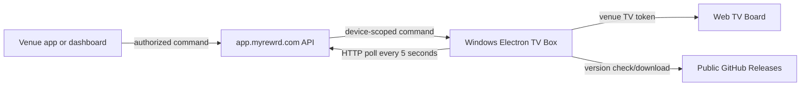

# myREWRD TV Box

The myREWRD TV Box is a remotely managed Electron application for Windows mini PCs connected to venue televisions. Venues connect power and HDMI; ongoing control stays in the venue app and dashboard rather than at the physical box.

## Display modes

| Mode | Behavior |
|---|---|
| Regular | Loads the venue’s standard TV Board with lineup, sponsors, recent activity, and related display content |
| Stream | Presents streaming content beside the configured TV information/sponsor layout |
| Game Day | Uses the 94% stream and 6% sponsor-bar layout required by the product |
| Live Games | Displays sanitized server-controlled game state through the TV Board |

## Game Day sponsor-logo compatibility

The dashboard `/api/tv-sponsor` payload currently uses snake-case logo fields. The Electron main process normalizes both snake-case and camel-case payloads before sending sponsor data to the isolated renderer. The Game Day sponsor bar then tries the compact logo first, followed by medium and standard assets; each sponsor update uses a versioned off-DOM image probe so a slow or failed prior sponsor image cannot overwrite a newer rotation.

This compatibility layer does not select sponsors, change rotation timing, or record impressions. Those responsibilities remain in the dashboard/API. A code merge alone does not put the fix on an installed box: the public Windows release and updater must deliver the new version, after which the physical Game Day sponsor bar must be verified.

This change is targeted for TV Box version `1.0.3`. Version `1.0.2` is already the registered production updater target, so reusing it would not update a device that already reports `1.0.2`.

## Architecture



The current client uses **HTTP polling**, not WebSockets. The dashboard/Vercel backend queues and returns device-scoped commands through `/api/tv-box-command`. The box stores its local configuration under the user’s AppData directory and loads the approved dashboard/TV URLs in Electron.

## Pairing

The primary installation flow is Platform → TV Devices → Provision Device and its individualized setup BAT. See [SETUP_GUIDE.md](SETUP_GUIDE.md); PIN pairing below is the fallback.

On an unconfigured device, the app generates a six-digit PIN and polls the dashboard pairing API. An authorized platform/venue operator enters that PIN in the provisioning interface. The backend issues the device’s venue configuration and TV token, which the box persists locally.

Pairing PINs are temporary capabilities. Do not log or reuse them beyond the pairing flow, and do not copy a token/configuration between venues.

## Local development

```bash
npm install
npm start
```

Run `node scripts/verify-wake-recovery.cjs`, `node scripts/verify-live-game-takeover.mjs`, and `node scripts/verify-gameday-sponsor-logo.mjs` for focused regression checks. There is no committed dependency lockfile; dependency reproducibility remains separate release debt.

## Sleep, wake, and relaunch (1.0.4 candidate)

Windows auto-login at boot does not disable password-on-wake, and idle sleep timeouts do not change the power button action. The updated dashboard setup sets AC/DC power and sleep buttons to Do Nothing and CONSOLELOCK to 0 for the dedicated local appliance. Existing boxes can use [scripts/Repair-TVBoxPower.ps1](scripts/Repair-TVBoxPower.ps1) locally as administrator under the dedicated `myrewrd` account. This script contains no device credential and does not reset passwords. It must not be applied to a personal or shared workstation. A held power button can still force hardware shutdown.

The Electron client restores the saved tokenized TV Board on resume/unlock and relaunch, restores kiosk presentation, and rechecks server mode/Live Game priority. Failed top-level navigation, server 5xx, or renderer termination schedules a bounded retry (including the Game Day stream). Command polls have timeouts and reject responses begun before suspend. Pairing is captured for both full-page and Next.js in-page navigation, only at the canonical HTTPS origin. Unpair clears active views and prevents wake from restoring the former token.

The board uses a server-validated venue TV token, not a dashboard/Supabase user session or refresh token. Invalid/revoked tokens remain invalid. No dashboard password is saved or automatically submitted. Existing AppData JSON and the default persistent Electron session are retained for installed-client and streaming compatibility; token-at-rest encryption is not introduced in this change. The device config IPC no longer returns the token, and pairing/command diagnostics do not print token-bearing URLs. Streaming providers can independently expire login sessions; the client cannot bypass provider authentication.

Before release, complete the physical acceptance checklist in SETUP_GUIDE.md. Source tests do not prove Windows firmware, managed policy, HDMI recovery, or actual public updater delivery. Version 1.0.4 is a candidate; the dashboard installer remains pinned to the verified 1.0.3 asset/hash until a reviewed release is approved and validated.

## Builds

```bash
npm run build:win-portable
npm run build:win
npm run build:mac
npm run build:linux
```

The production path is the portable Windows x64 artifact built by `.github/workflows/build-windows.yml` and published through GitHub Releases. A local cross-platform build command does not prove the deployed Windows appliance works.

## Updates and repository visibility

The updater downloads release assets without GitHub authentication. Therefore this repository **must remain public**. If it is made private, the download can return an HTML authorization page and Windows may report an invalid or “Unsupported 16-Bit Application” executable.

Before replacing the executable, the client rejects implausibly small downloads. Release verification must additionally download through the same public URL used by an installed box and confirm the file is a Windows binary.

## Security boundaries

| Boundary | Requirement |
|---|---|
| Device identity | Pairing/token must resolve to one device and venue |
| Commands | Dashboard API validates caller, venue, device, command type, and replay/expiry behavior |
| Public TV content | Never include phone numbers, Auth IDs, private messages, answer keys, payments, or internal notes |
| Local configuration | Treat TV tokens and saved sessions as sensitive; do not commit or print them |
| Navigation | Load only approved HTTPS service/display targets; do not accept arbitrary untrusted URLs |
| Updates | Public release availability, artifact validation, controlled restart, recoverable failure |

Streaming-service sessions can persist in the Electron browser profile. They are venue/provider credentials and must not be copied into logs or source.

## Release validation

Test a clean Windows device from first launch through PIN pairing, TV Board load, each remote command, mode switching, offline/reconnect, AppData migration, restart after power loss, and update from the previous released version. Exercise both a valid artifact and an invalid/small response. Confirm venue isolation with a wrong device/token.

Read [`AGENTS.md`](AGENTS.md) before editing. Cross-platform TV and operations documentation lives in `myREWRD/ssdt-dashboard/docs/product/TV_AND_LIVE_GAMES.md` and `docs/operations/DEPLOYMENT.md`.
