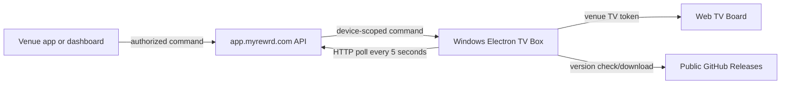

# myREWRD TV Box

## Presentation and remote enrollment (1.0.7 candidate)

The opt-in demo appliance can receive desired `tv_board`/`presentation` state through its existing poll. An isolated local WebRTC receiver supports Windows Chrome/Edge screen video; main-process control can destroy it even if its renderer freezes. No Chromecast, AirPlay, Miracast, audio capture, or adapter/hotspot switching is claimed.

Choose Set up receiver in Platform → TV Devices. The box generates its own 256-bit key, encrypts it under AppData with Windows DPAPI, and sends only a hash. Enter the code shown on the TV into the dashboard to approve the receiver; no keyboard or file transfer is required. The code is bound to a ten-minute session and immutable candidate hash, with five approval attempts. Only the internal myREWRD demo box supports this bootstrap; an existing trusted key cannot be silently replaced. Cancel setup or Launch TV Board closes the setup overlay. Advanced manual key import remains available for recovery. Preserve the normal TV token and Chromium profile. Presentation sessions expire after two hours and default to TV Board when expired/invalid; a receiver restart renews the sharing session, requiring the laptop to select Share again. A known preconfigured demo hotspot is needed for headless use where destination Wi-Fi is unknown. Windows wake sign-in requires the existing dedicated power repair and physical acceptance; Electron cannot unlock Windows.

Run `node scripts/verify-enrollment.cjs` and `npm run verify:presentation` plus existing wake, Live Game, sponsor, and updater suites. Canonical setup, security, relay configuration, release gate, and physical lifecycle checklist: dashboard `docs/product/TV_PRESENTATION.md`. Source merge can publish a Windows release; do not merge or advertise this candidate before approval.

The myREWRD TV Box is a remotely managed Electron application for Windows mini PCs connected to venue televisions. Venues connect power and HDMI; ongoing control stays in the venue app and dashboard rather than at the physical box.

## Display modes

| Mode | Behavior |
|---|---|
| Regular | Loads the venue’s standard TV Board with lineup, sponsors, recent activity, and related display content |
| Stream | Presents streaming content beside the configured TV information/sponsor layout |
| Game Day | Uses the 94% stream and 6% sponsor-bar layout required by the product |
| Live Games | Displays sanitized server-controlled game state through the TV Board |

## Game Day sponsor-logo compatibility

The dashboard `/api/tv-sponsor` payload currently uses snake-case logo fields. The Electron main process normalizes both snake-case and camel-case payloads before sending sponsor data to the isolated renderer. The Game Day sponsor bar then tries the compact logo first, followed by medium and standard assets; each sponsor update uses a versioned off-DOM image probe so a slow or failed prior sponsor image cannot overwrite a newer rotation.

This compatibility layer does not select sponsors, change rotation timing, or record impressions. Those responsibilities remain in the dashboard/API. A code merge alone does not put the fix on an installed box: the public Windows release and updater must deliver the new version, after which the physical Game Day sponsor bar must be verified.

This change is targeted for TV Box version `1.0.3`. Version `1.0.2` is already the registered production updater target, so reusing it would not update a device that already reports `1.0.2`.

## Architecture



The current client uses **HTTP polling**, not WebSockets. The dashboard/Vercel backend queues and returns device-scoped commands through `/api/tv-box-command`. The box stores its local configuration under the user’s AppData directory and loads the approved dashboard/TV URLs in Electron.

## Pairing

The primary installation flow is Platform → TV Devices → Provision Device and its individualized setup BAT. See [SETUP_GUIDE.md](SETUP_GUIDE.md); PIN pairing below is the fallback.

On an unconfigured device, the app generates a six-digit PIN and polls the dashboard pairing API. An authorized platform/venue operator enters that PIN in the provisioning interface. The backend issues the device’s venue configuration and TV token, which the box persists locally.

Pairing PINs are temporary capabilities. Do not log or reuse them beyond the pairing flow, and do not copy a token/configuration between venues.

## Local development

```bash
npm install
npm start
```

Run `node scripts/verify-wake-recovery.cjs`, `node scripts/verify-live-game-takeover.mjs`, and `node scripts/verify-gameday-sponsor-logo.mjs` for focused regression checks. There is no committed dependency lockfile; dependency reproducibility remains separate release debt.

## Sleep, wake, and relaunch

Windows auto-login at boot does not disable password-on-wake, and idle sleep timeouts do not change the power button action. The updated dashboard setup sets AC/DC power and sleep buttons to Do Nothing and CONSOLELOCK to 0 for the dedicated local appliance. Existing boxes can use [scripts/Repair-TVBoxPower.ps1](scripts/Repair-TVBoxPower.ps1) locally as administrator under the dedicated `myrewrd` account. This script contains no device credential and does not reset passwords. It must not be applied to a personal or shared workstation. A held power button can still force hardware shutdown.

The Electron client restores the saved tokenized TV Board on resume/unlock and relaunch, restores kiosk presentation, and rechecks server mode/Live Game priority. Failed top-level navigation, server 5xx, or renderer termination schedules a bounded retry (including the Game Day stream). Command polls have timeouts and reject responses begun before suspend. Pairing is captured for both full-page and Next.js in-page navigation, only at the canonical HTTPS origin. Unpair clears active views and prevents wake from restoring the former token.

The board uses a server-validated venue TV token, not a dashboard/Supabase user session or refresh token. Invalid/revoked tokens remain invalid. No dashboard password is saved or automatically submitted. Existing AppData JSON and the default persistent Electron session are retained for installed-client and streaming compatibility; token-at-rest encryption is not introduced in this change. The device config IPC no longer returns the token, and pairing/command diagnostics do not print token-bearing URLs. Streaming providers can independently expire login sessions; the client cannot bypass provider authentication.

Complete the physical acceptance checklist in SETUP_GUIDE.md. Source tests do not prove Windows firmware, managed policy, HDMI recovery, or actual public updater delivery. Version 1.0.4 was released on September 9, 2026, but its automatic update handoff failed on the venue box. The owner rebooted it and confirmed the paired board returned automatically. Advertising was restored to 1.0.3 with owner approval; the installer remains pinned there. Do not reactivate the rollout based on source tests alone.

## Update recovery candidate (1.0.5, unpublished)

The candidate downloads while the board remains running, requires the exact public version URL and SHA-256, and validates the Windows PE structure and size. It starts a native Windows supervisor from the stable install folder and waits for its readiness before exiting. The supervisor waits for the old process to exit, starts the replacement in an owned Windows Job, and commits Startup only after the paired board loads. Failed readiness/activation terminates the entire candidate Job, restores the previous Startup bytes, and launches the retained previous executable. Diagnostic write failures do not prevent rollback. Failed or interrupted transactions are not retried automatically by the new client.

The existing AppData configuration and Chromium profile stay in place; supervisor manifests contain paths, hashes, process identity, and transaction markers, never TV tokens or provider credentials. `update_sha256` is an additive dashboard command field backed by the reviewed release setting's `sha256`. Missing checksums keep the current board running. The existing dashboard push form does not yet populate this field; do not use it to activate this candidate.

Run `node scripts/verify-update.cjs` on Windows for real process success, crash, readiness timeout, activation timeout, and diagnostic-write failure cases. `scripts/build-packaged-fixtures.cjs` plus `scripts/verify-packaged-upgrade.cjs` exercise actual portable executables and Chromium persistence with isolated synthetic network responses. The PR workflow builds without publishing. `scripts/build-legacy-fixture.cjs` pins released 1.0.4 source and isolates its install directory to test its original handoff.

An independent watcher now retains the candidate Job while observing the supervisor. If the supervisor exits unexpectedly, it terminates the failed candidate, restores owned Startup state, and restarts the previous app. The application has a profile-specific single-instance lock so overlapping recovery attempts cannot open duplicate boards. Native forced-supervisor-termination recovery passed; the final packaged watchdog test is a required CI gate.

Release blockers remain: older clients do not honor the new failed-version record, so legacy adoption needs a separately verified delivery/retry policy; physical sleep/power policy acceptance is pending. The released `execFile` call ignores `detached` and `stdio`, causing its child to belong to libuv's kill-on-parent-exit Job. A native self-detaching launcher experiment passed the legacy handoff, but the old app can still exit before that bootstrap executes. This is not a guaranteed unattended installation path. Neither a heartbeat nor a successful download proves the board is visible. Keep rollout paused until these boundaries and representative hardware acceptance are resolved.

The follow-up also restricts navigation/redirects to approved HTTPS TV/provider destinations. Authentication popups have a separate empty preload, never device IPC, and close on wake recovery. The dashboard companion secures operator commands using verified staff identity and venue permission. Both phases of `scripts/electron-wake-integration.cjs` passed locally in real Electron 30.5.1 with hidden windows and isolated AppData: pairing, cold relaunch, cookie/local-storage persistence, wake/kiosk restoration, offline recovery, board and Game Day renderer crashes, and navigation/IPC rejection. Network responses and board/provider HTML are fixtures; power events are emitted, not physical sleep. Physical acceptance, real provider authentication, and previous-version updater delivery remain pending. No production release or remote-support service enrollment has occurred.

## Builds

```bash
npm run build:win-portable
npm run build:win
npm run build:mac
npm run build:linux
```

The production path is the portable Windows x64 artifact built by `.github/workflows/build-windows.yml` and published through GitHub Releases. A local cross-platform build command does not prove the deployed Windows appliance works.

## Updates and repository visibility

The updater downloads release assets without GitHub authentication. Therefore this repository **must remain public**. If it is made private, the download can return an HTML authorization page and Windows may report an invalid or “Unsupported 16-Bit Application” executable.

Before replacing the executable, the client rejects implausibly small downloads. Release verification must additionally download through the same public URL used by an installed box and confirm the file is a Windows binary.

## Security boundaries

| Boundary | Requirement |
|---|---|
| Device identity | Pairing/token must resolve to one device and venue |
| Commands | Dashboard API validates caller, venue, device, command type, and replay/expiry behavior |
| Public TV content | Never include phone numbers, Auth IDs, private messages, answer keys, payments, or internal notes |
| Local configuration | Treat TV tokens and saved sessions as sensitive; do not commit or print them |
| Navigation | Load only approved HTTPS service/display targets; do not accept arbitrary untrusted URLs |
| Updates | Public release availability, artifact validation, controlled restart, recoverable failure |

Streaming-service sessions can persist in the Electron browser profile. They are venue/provider credentials and must not be copied into logs or source.

## Release validation

Test a clean Windows device from first launch through PIN pairing, TV Board load, each remote command, mode switching, offline/reconnect, AppData migration, restart after power loss, and update from the previous released version. Exercise both a valid artifact and an invalid/small response. Confirm venue isolation with a wrong device/token.

Read [`AGENTS.md`](AGENTS.md) before editing. Cross-platform TV and operations documentation lives in `myREWRD/ssdt-dashboard/docs/product/TV_AND_LIVE_GAMES.md` and `docs/operations/DEPLOYMENT.md`.
