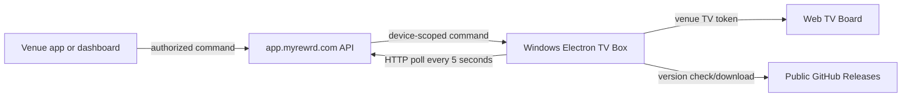

# myREWRD TV Box

## Provider-account sign-in development (2026-09-20, unreleased)

The new receiver polls a separate authenticated `/api/tv-provider-accounts` endpoint for one-shot, short-lived account jobs. It uses a hidden sandboxed provider window sharing this box's existing session, pauses live remote control, rejects duplicate jobs and stops on key/context changes. Credentials are transient and never written to config, logs or command receipts. Only the observed Hulu email/password forms are implemented; unknown verification steps require attention. A submitted form is not verified playback. The canonical dashboard `docs/security/TV_PROVIDER_ACCOUNTS.md` defines the vault and release gates. Package 2.3.14 is an unaccepted candidate; provisioning remains accepted 2.3.13 until validation and promotion.

## TV release and new-device provisioning must stay aligned

Every approved production TV build/update is incomplete until the dashboard new-device and migration installer pins are updated to that same accepted version, ZIP SHA256 and setup-script SHA256. Publish immutable signed ZIP and versioned setup assets together; verify their public downloads, update provisioning tests and canonical release status in a companion PR, merge/deploy it, and run the published-release verifier. Never announce completion based only on a test-box OTA. ZIP-only, explicitly scoped canaries may remain newer while acceptance is pending; publishing a production setup script makes it subject to provisioning alignment. Do not silently overwrite a published version or promote an unaccepted candidate. A rollback must coordinate installer defaults and deployed-device offers and document the reason; do not remove release history to silence drift checks.

Dashboard `scripts/verify-tv-provisioning-release.mjs` compares the pin with the newest published versioned setup asset and validates both asset digests plus the downloaded installer's checksum and embedded runtime version/hash. Provisioning CI runs on relevant PRs/main changes and daily; a failure is release drift to fix, not permission to auto-upgrade devices. Fleet OTA remains a separately scoped release decision.


## 2.3.13 candidate: observed Hulu live page

Physical 2.3.12 testing found Hulu's active live guide/player route is `/live`, with no channel query/hash. Its playing top-document video stayed in a mini-player because only `/live-tv` and `/watch/<id>` were recognized. Accept the exact `/live` path on the existing www.hulu.com HTTPS origin for fullscreen and local playback-page recall; continue rejecting suffix/account/auth-host variants and stripping queries/fragments. Hulu's selected channel on this generic live page remains provider-owned session state, so page restoration alone does not prove exact-channel or live-edge acceptance. No new origin or authentication scope is allowed. Physical verification is required before completion.

## 2.3.12 candidate: fullscreen geometry and provider restoration

The provider view uses the actual fullscreen window content bounds and follows resize/fullscreen changes. Windows workAreaSize excludes the taskbar and previously left a gap before the sponsor strip (observed window 1280x720, work area 1280x672, provider height 632). The separate 6vh sponsor/ticker strip is preserved. Whole-picture fitting still requires narrow side bars for a 16:9 broadcast above that strip; no crop/stretch is introduced.

Each supported provider's allowlisted playback path is saved locally as gameDayResumeUrls in the existing paired-device config. Main-frame and SPA navigation capture changes, plus the existing capture before leaving. Query strings, fragments, sign-in/account/foreign routes are excluded; invalid persisted entries are rejected on load. Re-pair/unpair clears these paths and the provider selection. Paths are not sent to the backend. Existing configs without this optional field still open the provider home.

Returning to a saved route starts a 60-second, three-attempt restoration window for that exact provider/path. It requests play and uses a visible exact Go live/Back to live/Jump to live/Return to live provider control when available; it does not seek finite VOD to its end. Main-process input/navigation cancellation and an armed renderer trusted-input guard prevent delayed restoration from overriding operator input. Media play promises do not block later provider restores. Selecting an already active provider playback page avoids reloading it. Authentication, subscription access, ended events and provider redirects may require operator action; this does not guarantee a live edge on providers without a supported control.

Validation includes route privacy/restart/reset tests, bounded resume/cancellation/stalled-media tests and a real Windows Electron geometry test at 720p, 1080p and resize. Physical provider switching/restart and production package acceptance must be recorded separately in canonical dashboard docs.

## 2.3.8 automatic provider player expansion (candidate)

On supported selected-provider playback routes, Game Day detects a visible playing video and requests player fullscreen inside its 94% BrowserView. It first gives the provider's own button a bounded opportunity to enter fullscreen, then falls back to the existing video's native fullscreen/controls. No media element is replaced or moved; DRM and playback sessions remain provider-owned. Native controls are restored to their earlier state on exit. The sponsor strip stays outside the view.

Fullscreen is attempted at most three times per video and stops after success; Dismiss/Escape is respected so operators can choose another channel. Sign-in fields, provider popups, provider home pages and other display modes are excluded. Cross-origin iframe video is not inspected. Provider-specific physical acceptance remains required; this is not a claim of universal fullscreen compatibility.

[DIAGNOSED; FIX ACCEPTANCE PENDING 2026-09-19] Physical TV network diagnostics show Hulu returns HTTP 302 to the exact Adobe Pass `/adobe-services/oauth2` callback, which 2.3.6 rejects. Candidate 2.3.7 permits that exact HTTPS production-host path only with one bounded nonempty code and state parameter. No auth values are retained or logged. Missing/duplicate fields, child hosts and sibling paths remain rejected. End-to-end provider login acceptance remains pending.

## 2.3.7 sponsor-strip correction (candidate)

Restores the sponsorship label, logo and name to one line with a single full-width ticker behind a feathered center panel. Provider geometry stays 94% / 6%. The immutable signed 2.3.6 test release is installed on the test TV; ESPN/Hulu sign-in remains unresolved. This candidate is not yet released or installed.

## Game Day protected playback candidate (2.1.0)

The Windows candidate uses CastLabs ECS with runtime Widevine initialization and explicit production VMP signing. It retains the Game Day sponsor strip, remote controls and existing sessions. Development builds are not proof of YouTube TV playback. See [protected playback implementation and acceptance](docs/PROTECTED_PLAYBACK.md) before building or releasing. Provider playback, signing-account setup and physical Windows update acceptance remain pending; no production rollout is included.

## Remote-maintenance status — 2026-09-12

Version 2.0.1 adds read-only Windows status sampling every 60 seconds when paired and receiver-key enrolled. A bounded hidden PowerShell probe checks the Google-signed host executable, presence of host configuration filenames (never contents), and the `chromoting` service. The service name was verified from the official Google host MSI ServiceInstall table. Errors/permissions failures produce unknown values; absence is distinct. No host software is installed or registered by this probe.

Fresh samples use `/api/tv-presentation` action `remote_status` with the existing device token and DPAPI receiver secret. Fields are `host_installed`, `registration_present`, `service_state` (running/stopped/missing/unknown), and `reporter_version: "1"`. The process never logs credentials or provider configuration and does not retry cached samples. Suspend, unpair, and shutdown abort pending reporting; inactive update candidates do not report. Host configuration/service status is not evidence of remote connectivity, Google account ownership, UAC operation, or successful reboot/reconnect. Backend status must expire when fresh authenticated reports stop.

Validation: `node scripts/verify-remote-status.cjs` and `powershell.exe -NoProfile -File scripts/verify-remote-status.ps1` use fixtures/mocks and do not install or enroll Google software. Windows release CI runs both; packaged PowerShell remains under the existing `src/*.ps1` asar-unpack rule.

**2026-09-11 supersession:** Version 2.0.0 uses permanent installed runtime paths. See [installed runtime migration and recovery](INSTALLED_RUNTIME.md). Earlier portable instructions below are historical for 1.x only.

## Presentation and remote enrollment (1.0.7 candidate)

The opt-in demo appliance can receive desired `tv_board`/`presentation` state through its existing poll. An isolated local WebRTC receiver supports Windows Chrome/Edge screen video; main-process control can destroy it even if its renderer freezes. No Chromecast, AirPlay, Miracast, audio capture, or adapter/hotspot switching is claimed.

Choose Set up receiver in Platform → TV Devices. The box generates its own 256-bit key, encrypts it under AppData with Windows DPAPI, and sends only a hash. Enter the code shown on the TV into the dashboard to approve the receiver; no keyboard or file transfer is required. The code is bound to a ten-minute session and immutable candidate hash, with five approval attempts. Only the internal myREWRD demo box supports this bootstrap; an existing trusted key cannot be silently replaced. Cancel setup or Launch TV Board closes the setup overlay. Advanced manual key import remains available for recovery. Preserve the normal TV token and Chromium profile. Presentation sessions expire after two hours and default to TV Board when expired/invalid; a receiver restart renews the sharing session, requiring the laptop to select Share again. A known preconfigured demo hotspot is needed for headless use where destination Wi-Fi is unknown. Windows wake sign-in requires the existing dedicated power repair and physical acceptance; Electron cannot unlock Windows.

Run `node scripts/verify-enrollment.cjs` and `npm run verify:presentation` plus existing wake, Live Game, sponsor, and updater suites. Canonical setup, security, relay configuration, release gate, and physical lifecycle checklist: dashboard `docs/product/TV_PRESENTATION.md`. Source merge can publish a Windows release; do not merge or advertise this candidate before approval.

The myREWRD TV Box is a remotely managed Electron application for Windows mini PCs connected to venue televisions. Venues connect power and HDMI; ongoing control stays in the venue app and dashboard rather than at the physical box.

## Display modes

| Mode | Behavior |
|---|---|
| Regular | Loads the venue’s standard TV Board with lineup, sponsors, recent activity, and related display content |
| Stream | Presents streaming content beside the configured TV information/sponsor layout |
| Game Day | Uses the 94% stream and 6% sponsor-bar layout required by the product |
| Live Games | Displays sanitized server-controlled game state through the TV Board |

## Game Day sponsor-logo compatibility

The dashboard `/api/tv-sponsor` payload currently uses snake-case logo fields. The Electron main process normalizes both snake-case and camel-case payloads before sending sponsor data to the isolated renderer. The Game Day sponsor bar then tries the compact logo first, followed by medium and standard assets; each sponsor update uses a versioned off-DOM image probe so a slow or failed prior sponsor image cannot overwrite a newer rotation.

This compatibility layer does not select sponsors, change rotation timing, or record impressions. Those responsibilities remain in the dashboard/API. A code merge alone does not put the fix on an installed box: the public Windows release and updater must deliver the new version, after which the physical Game Day sponsor bar must be verified.

This change is targeted for TV Box version `1.0.3`. Version `1.0.2` is already the registered production updater target, so reusing it would not update a device that already reports `1.0.2`.

## Architecture



The current client uses **HTTP polling**, not WebSockets. The dashboard/Vercel backend queues and returns device-scoped commands through `/api/tv-box-command`. The box stores its local configuration under the user’s AppData directory and loads the approved dashboard/TV URLs in Electron.

## Pairing

The primary installation flow is Platform → TV Devices → Provision Device and its individualized setup BAT. See [SETUP_GUIDE.md](SETUP_GUIDE.md); PIN pairing below is the fallback.

On an unconfigured device, the app generates a six-digit PIN and polls the dashboard pairing API. An authorized platform/venue operator enters that PIN in the provisioning interface. The backend issues the device’s venue configuration and TV token, which the box persists locally.

Pairing PINs are temporary capabilities. Do not log or reuse them beyond the pairing flow, and do not copy a token/configuration between venues.

## Local development

```bash
npm install
npm start
```

Run `node scripts/verify-wake-recovery.cjs`, `node scripts/verify-live-game-takeover.mjs`, and `node scripts/verify-gameday-sponsor-logo.mjs` for focused regression checks. There is no committed dependency lockfile; dependency reproducibility remains separate release debt.

## Sleep, wake, and relaunch

Windows auto-login at boot does not disable password-on-wake, and idle sleep timeouts do not change the power button action. The updated dashboard setup sets AC/DC power and sleep buttons to Do Nothing and CONSOLELOCK to 0 for the dedicated local appliance. Existing boxes can use [scripts/Repair-TVBoxPower.ps1](scripts/Repair-TVBoxPower.ps1) locally as administrator under the dedicated `myrewrd` account. This script contains no device credential and does not reset passwords. It must not be applied to a personal or shared workstation. A held power button can still force hardware shutdown.

The Electron client restores the saved tokenized TV Board on resume/unlock and relaunch, restores kiosk presentation, and rechecks server mode/Live Game priority. Failed top-level navigation, server 5xx, or renderer termination schedules a bounded retry (including the Game Day stream). Command polls have timeouts and reject responses begun before suspend. Pairing is captured for both full-page and Next.js in-page navigation, only at the canonical HTTPS origin. Unpair clears active views and prevents wake from restoring the former token.

The board uses a server-validated venue TV token, not a dashboard/Supabase user session or refresh token. Invalid/revoked tokens remain invalid. No dashboard password is saved or automatically submitted. Existing AppData JSON and the default persistent Electron session are retained for installed-client and streaming compatibility; token-at-rest encryption is not introduced in this change. The device config IPC no longer returns the token, and pairing/command diagnostics do not print token-bearing URLs. Streaming providers can independently expire login sessions; the client cannot bypass provider authentication.

Complete the physical acceptance checklist in SETUP_GUIDE.md. Source tests do not prove Windows firmware, managed policy, HDMI recovery, or actual public updater delivery. Version 1.0.4 was released on September 9, 2026, but its automatic update handoff failed on the venue box. The owner rebooted it and confirmed the paired board returned automatically. Advertising was restored to 1.0.3 with owner approval; the installer remains pinned there. Do not reactivate the rollout based on source tests alone.

## Update recovery candidate (1.0.5, unpublished)

The candidate downloads while the board remains running, requires the exact public version URL and SHA-256, and validates the Windows PE structure and size. It starts a native Windows supervisor from the stable install folder and waits for its readiness before exiting. The supervisor waits for the old process to exit, starts the replacement in an owned Windows Job, and commits Startup only after the paired board loads. Failed readiness/activation terminates the entire candidate Job, restores the previous Startup bytes, and launches the retained previous executable. Diagnostic write failures do not prevent rollback. Failed or interrupted transactions are not retried automatically by the new client.

The existing AppData configuration and Chromium profile stay in place; supervisor manifests contain paths, hashes, process identity, and transaction markers, never TV tokens or provider credentials. `update_sha256` is an additive dashboard command field backed by the reviewed release setting's `sha256`. Missing checksums keep the current board running. The existing dashboard push form does not yet populate this field; do not use it to activate this candidate.

Run `node scripts/verify-update.cjs` on Windows for real process success, crash, readiness timeout, activation timeout, and diagnostic-write failure cases. `scripts/build-packaged-fixtures.cjs` plus `scripts/verify-packaged-upgrade.cjs` exercise actual portable executables and Chromium persistence with isolated synthetic network responses. The PR workflow builds without publishing. `scripts/build-legacy-fixture.cjs` pins released 1.0.4 source and isolates its install directory to test its original handoff.

An independent watcher now retains the candidate Job while observing the supervisor. If the supervisor exits unexpectedly, it terminates the failed candidate, restores owned Startup state, and restarts the previous app. The application has a profile-specific single-instance lock so overlapping recovery attempts cannot open duplicate boards. Native forced-supervisor-termination recovery passed; the final packaged watchdog test is a required CI gate.

Release blockers remain: older clients do not honor the new failed-version record, so legacy adoption needs a separately verified delivery/retry policy; physical sleep/power policy acceptance is pending. The released `execFile` call ignores `detached` and `stdio`, causing its child to belong to libuv's kill-on-parent-exit Job. A native self-detaching launcher experiment passed the legacy handoff, but the old app can still exit before that bootstrap executes. This is not a guaranteed unattended installation path. Neither a heartbeat nor a successful download proves the board is visible. Keep rollout paused until these boundaries and representative hardware acceptance are resolved.

The follow-up also restricts navigation/redirects to approved HTTPS TV/provider destinations. Authentication popups have a separate empty preload, never device IPC, and close on wake recovery. The dashboard companion secures operator commands using verified staff identity and venue permission. Both phases of `scripts/electron-wake-integration.cjs` passed locally in real Electron 30.5.1 with hidden windows and isolated AppData: pairing, cold relaunch, cookie/local-storage persistence, wake/kiosk restoration, offline recovery, board and Game Day renderer crashes, and navigation/IPC rejection. Network responses and board/provider HTML are fixtures; power events are emitted, not physical sleep. Physical acceptance, real provider authentication, and previous-version updater delivery remain pending. No production release or remote-support service enrollment has occurred.

## Builds

```bash
npm run build:win-portable
npm run build:win
npm run build:mac
npm run build:linux
```

The production path is the portable Windows x64 artifact built by `.github/workflows/build-windows.yml` and published through GitHub Releases. A local cross-platform build command does not prove the deployed Windows appliance works.

## Updates and repository visibility

The updater downloads release assets without GitHub authentication. Therefore this repository **must remain public**. If it is made private, the download can return an HTML authorization page and Windows may report an invalid or “Unsupported 16-Bit Application” executable.

Before replacing the executable, the client rejects implausibly small downloads. Release verification must additionally download through the same public URL used by an installed box and confirm the file is a Windows binary.

## Security boundaries

| Boundary | Requirement |
|---|---|
| Device identity | Pairing/token must resolve to one device and venue |
| Commands | Dashboard API validates caller, venue, device, command type, and replay/expiry behavior |
| Public TV content | Never include phone numbers, Auth IDs, private messages, answer keys, payments, or internal notes |
| Local configuration | Treat TV tokens and saved sessions as sensitive; do not commit or print them |
| Navigation | Load only approved HTTPS service/display targets; do not accept arbitrary untrusted URLs |
| Updates | Public release availability, artifact validation, controlled restart, recoverable failure |

Streaming-service sessions can persist in the Electron browser profile. They are venue/provider credentials and must not be copied into logs or source.

## Release validation

Test a clean Windows device from first launch through PIN pairing, TV Board load, each remote command, mode switching, offline/reconnect, AppData migration, restart after power loss, and update from the previous released version. Exercise both a valid artifact and an invalid/small response. Confirm venue isolation with a wrong device/token.

Read [`AGENTS.md`](AGENTS.md) before editing. Cross-platform TV and operations documentation lives in `myREWRD/ssdt-dashboard/docs/product/TV_AND_LIVE_GAMES.md` and `docs/operations/DEPLOYMENT.md`.

## Fleet presentation recovery - 2026-09-11

Owner approved local-network presentation for all current/future devices. Version 1.0.8 returns to the regular board after five seconds of failed/offline receiver status; an unresponsive renderer falls back within the watchdog limit. The ended session cannot reopen from stale polling, and a key-authenticated report clears only the matching backend session/revision. A new presentation starts a new session. Ending sharing or leaving the laptop TV Devices page closes sharing; other venue modes/controls remain available when casting is inactive.

The portable extraction directory is deliberately versioned: myREWRD-TV-Box-1.0.8 under the kiosk user's TEMP directory. Build validation requires it to match the release version. Administrator setup must install exact-runtime TCP/UDP LocalSubnet firewall rules before first use. Existing installations still need attended firewall approval for a new runtime path. Do not substitute a single permanent extraction directory: launcher cleanup can race with updates. Release checklist: verify executable checksum and embedded runtime directory; update dashboard installer version/hash and rules together; physically test clean Windows local-network casting. This does not claim an existing box can remotely elevate or that future updates inherit previous per-version firewall permissions.

## Venue app provider remote (candidate)

### 2.3.3 player audio correction

Mute/Unmute now synchronizes the selected provider's top-document HTML video/audio elements (including open shadow roots) with Electron output mute. Saved YouTube embeds start muted; clearing only Electron mute did not enable their sound. Unmute preserves nonzero player volume and restores zero volume to 50%. It does not start paused media, change the Windows/TV volume, or access cross-origin child players. The fixed isolated script accepts only a boolean; the existing selected-view, authorization, loading and navigation checks remain. Both live and fallback remotes use this same handler. A signed box update is required; no mobile OTA or API change is needed. Physical audio acceptance remains separate from synthetic Chromium mute-state checks.

See [provider remote setup and release gates](docs/PROVIDER_REMOTE.md). This source is not a fleet release.

## TV control 2.3.0 source contract (2026-09-18)

The coordinated dashboard/app/box release restores Regular TV Board, Live Stream and Game Day. Game Day supports selected-TV Play saved URL without toggling mode. An explicit live remote uses an eight-second receiver lease, fixed 15-minute session, provider-only preview and bounded pointer input. Mobile opens a first-party browser with a one-use scoped handoff; no native dependency/runtime change. Main-page navigation ends the current connection; Start again reconnects. Protected video can appear black in previews. Same-network peer connectivity is required unless TURN is configured. Signed Windows/physical playback and fleet promotion remain separate gates. Canonical contract and validation: ssdt-dashboard/docs/product/TV_LIVE_REMOTE.md.

## Live-remote diagnostics (2.3.1)

The 2.3.2 candidate adds conservative zero-area child-frame handling. The physical Hulu failure was a child-frame pre-scan exception with 21 frames. Before and after capture, an isolated geometry check must match every direct child window to a connected iframe/frame owner with no positive-area rectangle, and its count must match Electron's native direct-child count. Only then may descendant JavaScript inspection be skipped. Visible, unmatched, shadow-root count mismatches and object/embed cases retain full inspection and fail closed. Frame/document identities must remain unchanged through capture. No hidden result is cached. This remains defense in depth against third-party rendering, not an absolute credential-exclusion guarantee. Physical Hulu acceptance remains pending.

The receiver generates and overwrites one local file named live-remote-status.json in its existing AppData profile when a live session stops; this file is not part of the repository. It contains only fixed reason/stage enums, a timestamp, bounded frame count and main-frame boolean; no URL, credential, DOM or raw error message. A sensitive post-capture scan now ends the session immediately. Other privacy and input boundaries remain in place. This candidate diagnoses the physical Hulu preview disconnect observed on 2.3.0; it does not claim that issue is fixed. See the dashboard canonical TV_LIVE_REMOTE and release-status documents.

### 2.3.9 fullscreen recovery candidate

2.3.8 failed physical fullscreen retention: ESPN returned to its webpage and scrollbar. The recovery candidate distinguishes explicit keyboard/pointer dismissal from provider-driven fullscreen exits. Unexpected exits retry after four seconds, with one document-wide budget of three requests per minute across replacement videos. A single listener set avoids retaining old ad/player nodes. Broadcast geometry remains unmodified (whole picture, 94% provider / 6% sponsor); physical acceptance is required before calling the fix complete.

### 2.3.10 ESPN live-route correction

Physical diagnosis found ESPN Watch Live navigates to `/watch/player/_/id/<id>/startOption/live`; the prior playback-route gate excluded that exact suffix, so neither automatic fullscreen nor channel recall ran there. Accept only that observed optional suffix on the existing exact ESPN HTTPS origin. Queries/fragments are still discarded; other suffixes and auth hosts remain rejected. 2.3.9 did not pass fullscreen acceptance; this correction requires a new signed physical test.

### 2.3.11 updater process identity

The main process supplies Electron process metrics creationTime (OS epoch milliseconds) to the update supervisor instead of estimating start time from Node uptime. A physical 2.3.9 to 2.3.10 update stopped safely because its estimate differed by 5430 ms from Windows, exceeding the unchanged 5000 ms identity tolerance. Missing/mismatched metrics fail closed. PID, executable hashes, supervisor timestamp tolerance and rollback remain unchanged.

## Provider sign-in loading follow-up (unreleased)

The Hulu runner no longer waits for every page subresource before inspecting its exact allowed form. Main-frame loading still gates injection, origin/path/form checks remain mandatory, and the loop leaves 12 seconds before job expiry for result reporting. This margin is not a separate timeout around JavaScript execution; the worker abort remains the final bound. Unit fixtures cover a never-settling full-load promise and a stalled main frame; the hidden Windows Electron fixture passed with synthetic forms and no provider network. This fixes a possible stall mechanism, not a proven physical timeout root cause. Actual Hulu acceptance and all other provider adapters remain pending. Published 2.3.14 is immutable; any next artifact needs a new version and must not be promoted without acceptance.

### 2.3.15 candidate — provider acceptance pending
The Hulu load-handling follow-up is packaged under a new immutable candidate version. Unit account, fullscreen and resume checks pass; this is not all-provider physical sign-in/playback acceptance. Keep accepted provisioning at 2.3.13 until the candidate passes the recorded hardware/provider gates and matching setup assets are published.


Peacock candidate: protocol 2 adds exact observed top-level /start and /signin forms on www.peacocktv.com. Private sign-in remains hidden; challenge, unexpected navigation and location requests require attention. Synthetic Windows Chromium email/password steps pass for Hulu and Peacock. This is not physical sign-in acceptance; protocol 1 remains Hulu-only and the backend requires 2.3.15 for Peacock.


### 2.3.16 candidate

Adds separate YouTube / NFL Sunday Ticket destination (existing youtube remains YouTube TV), sanitized video-ID restoration, and ephemeral ordinary-field keyboard input in the live remote. Private sign-in pages remain excluded. Fixed non-sensitive sign-in failure reasons aid Peacock diagnosis; real Peacock acceptance is pending. This candidate does not change accepted provisioning until physical acceptance and companion pin alignment.
